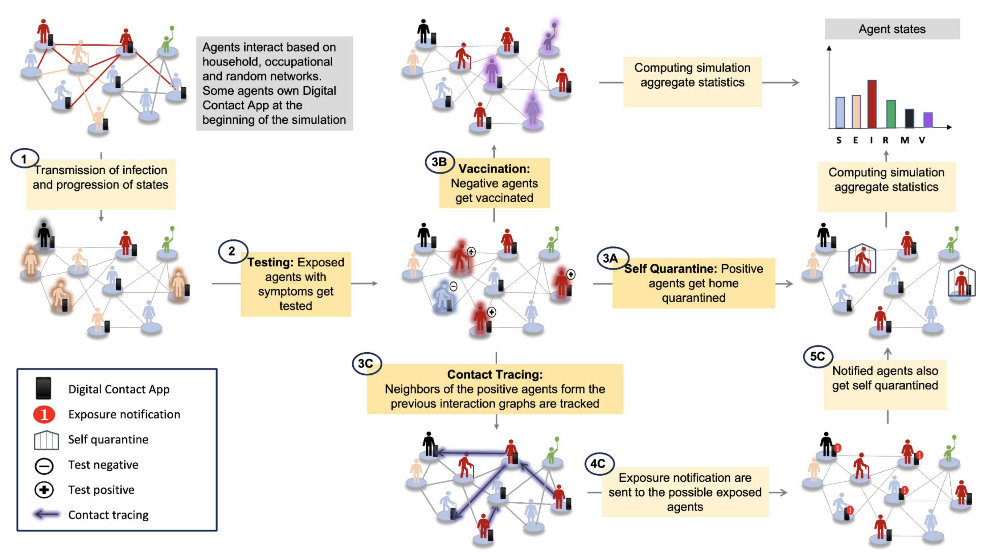
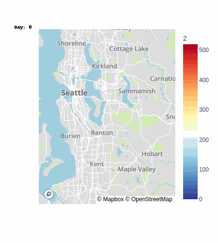

# First 100 days of pandemic; an interplay of pharmaceutical, behavioral and digital interventions – A study using agent-based modeling

This is the github repo for the paper: [First 100 days of pandemic; an interplay of pharmaceutical, behavioral and digital interventions – A study using agent-based modeling](https://arxiv.org/abs/2401.04795)

## Interventions Supported

- Pharmaceutical: Testing(specificity, speed), Two-dose Vaccination (delay days, efficacy)
- Behavioral: Self-Quarantine (days, break probability)
- Contact Tracing: Digital (adoption rate, compliance probability), Manual (compliance probability), Hybrid 2-Step
  
<br />
 Implementation of different interventions - Testing, Self-quarantine, Vaccination, and Contact Tracing. (1) Infection
spreads through the interaction of infected with susceptible agents, and the states of the agents are then updated based on
disease progression. (2) Upon experiencing symptoms, exposed agents get themselves tested (3a) If tested positive, agents
undergo self-quarantine with compliance. A quarantined agent then engages in no further interactions until the quarantine
period ends. The interaction graph of quarantine agents is thus an isolated point (3b) Agents that have not tested positive or
are not quarantined get vaccinated. Vaccination reduces the susceptibility of an agent to infection risk (3c) In case of contact
tracing: interactions of the positively tested agents (that own app in case of DCT) from the previous interaction graphs of past
days are tracked; (4c) exposure notifications are sent to the possibly exposed tracked agents (that own the app in case of DCT);
(5c) notified agents then opt for self-quarantine. (Last) After simulating for N days, the aggregate statistics of the agent states
are computed. Agent states here are: susceptible (S), exposed (E), infected (I), recovered (R), mortal (M), and vaccinated (V)

## Geographical Spread
### Infections in Kings County Washington since the beginning of pandemic
No Intervention            |  Vaccination+Contact Tracing+Self Quarantine
:-------------------------:|:-------------------------:
 | 

## Installation

To install all dependencies for training and inference, please run:

```
pip install -r requirements.txt
```

## Running the code
To run the code. Select the configs you want to run. The logs will be saved in the './logs' directory and the checkpoints will be stored in './Data/Results' folder.
```
sh run_file.sh
```
We provide configurations for various interventions such as:
1. `--params_no_inter.yaml` for no intervention (NI)
2. `--params_sq.yaml` for self-qurantine alone (SQ)
3. `--params_vacc.yaml` for 2-dose vaccination alone (VACC)
4. `--params_ct.yaml` for 2-step Contact tracing and testing (CT)
5. `--params_vacc_sq_test.yaml` for vaccination, testing and self-quarantine (VACC+SQ)
6. `--params_vacc_ct.yaml` for all interventions activated: vaccination, self-quarantine, testing and contact tracing (VACC+ CT)
    
The parameters in the config can be modified to run different settings
## Acknowledgements

Our implementation is based on [DeepABM](https://arxiv.org/pdf/2110.04421.pdf). We thank the authors for their work.

## Citation
```
@misc{gupta2024100,
      title={First 100 days of pandemic; an interplay of pharmaceutical, behavioral and digital interventions -- A study using agent based modeling}, 
      author={Gauri Gupta and Ritvik Kapila and Ayush Chopra and Ramesh Raskar},
      year={2024},
      eprint={2401.04795},
      archivePrefix={arXiv},
      primaryClass={cs.MA}
}
```

## Contact
Please email: gaurii@mit.edu
